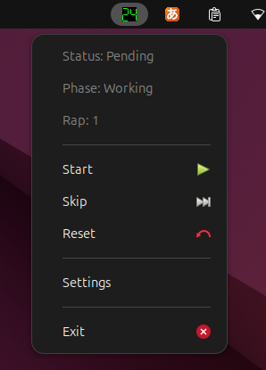

# pomodoro-sni

[](https://crates.io/crates/pomodoro-sni)

A simple Pomodoro Timer for Linux displays on status bars as an implementation of [StatusNotifierItem](https://www.freedesktop.org/wiki/Specifications/StatusNotifierItem/?__goaway_challenge=meta-refresh&__goaway_id=ff7c89a0ae4e647a4fa3e3f8ea2178ae&__goaway_referer=https%3A%2F%2Fwww.freedesktop.org%2F).

<p align="center">
  
</p>

## Features

- You can configure times, sound files, sound volume, colors, and long-break positions.  
- The pomodoro-sni implements StatusNotifierItem interface, so it works without any additional shell extensions or specific status bar implementations in many desktop environments.
- No dependencies on GUI toolkit. It depends on the dbusmenu protocol.
- You can start timer(not app) from external process or apps via `pomodoro-sni start` command. It is useful for scheduling the start time.

## Installation

### cargo

pomodoro-sni depends on [rodio](https://github.com/RustAudio/rodio) crate for audio playback, which requires `libasound2-dev` on Debian(Ubuntu) or `alsa-lib-devel` on Fedora for build.

```sh
cargo install pomodoro-sni
```

### Prebuilt binary

You can download pre-built binary from the github [release page](https://github.com/deepgreenAN/pomodoro-sni/releases).
